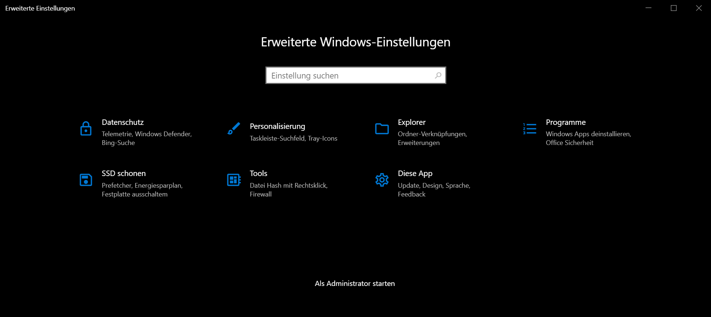

<p align="center">
  <a href="https://tsmr.eu">
    
  </a>
</p>

<h3 align="center">Erweiterte Windows-Einstellungen</h3>

<p align="center">
    Erweiterte Windows-Einstellungen ist eine <b>Sammlung von Einstellungen</b>, die der Benutzer nicht oder nur auf sehr umständliche Weise über die Benutzeroberfläche ändern kann. Einstellungen, die nicht in der offiziellen Dokumentation von Microsoft enthalten sind, werden zunächst erläutert und sind mit einer <b>Quellenangabe</b> versehen.
    <br><br>
    --- <a href="https://win10settings.oproj.de/"><strong>Webseite </strong></a> ---
    <a href="#download"><strong>Download</strong></a> ---
    <br>
    <br>
    
    <a href="https://paypal.me/otsmr"></a>
    <br>
    <br>
</p>



# Inhaltsverzeichnis
* <a href="#features">Features</a>
* <a href="#download">Download</a>
* <a href="#dokumentation">Dokumentation</a>
* <a href="#copyright-und-lizenz">Copyright und Lizenz</a>

# Features

* Mehr **Datenschutz für Windows 10**
* **Datenschutzniveau** nach **BSI-Empfehlung**
* **Werbung** in Windows 10 **deaktivieren**
* Einstellungen um die **SSD zu schonen** 
* Windows-**Apps** mit **einem Klick entfernen**
* Explorer **Ordner-Verknüpfungen entfernen** (3D-Objekte, Musik, ...)
* Programm-Verknüpfungen im Explorer entfernen (OneDrive, Adobe, ...)
* **Datei-Hash** mit einem Klick erzeugen (**SHA1**, **SHA256**, ...)

# Download

<b>Laden Sie die aktuellste Version von der <a href="https://win10settings.oproj.de/">Webseite</a> oder der <a href="https://github.com/otsmr/win10settings/releases">Releases-Seite</a> herunter.</b>

# Dokumentation

## Erste Schritte
Benötigt werden NodeJS und Git.  

**Erweiterte Windows Einstellungen selber kompilieren**
```bash
git clone https://github.com/otsmr/win10settings.git
cd win10settings
npm install
npm run build
```

**Entwicklungsumgebung starten**
```bash
npm run dev
```

## Struktur des Codes

| Ordner / Datei | Beschreibung |
| ------ | ------------ |
| `/build` | Dieser Ordner wird von `React` erstellt und enthält den Produktions-Frontend-Code. |
| `/dist` | Wird von `electron-builder` erstellt und enthält die **gepackte Windows-Anwendung**. |
| `/public` | Enthält das Backend und die statischen Dateien der Anwendung. |
| `/public/electron/configs` | **Powershell-Befehle**, die ausgeführt werden, um die Einstellungen zu ändern. |
| `/public/config.json` | Die **Standardeinstellungen**. |
| `/src` | Das Frontend der App in React und Typescript. |
| `/src/localization` | Sprachdateien |
| `/webpage` | Statische Webseite |

# ToDo

## Sprachen

## Datenschutz
https://www.der-windows-papst.de/wp-content/uploads/2019/06/Privatsph%C3%A4re-f%C3%BCr-Windows-10-Pro-Heimarbeitspl%C3%A4tze.pdf  
https://www.der-windows-papst.de/2015/12/24/windows-10-spy-deaktivieren/  
https://www.der-windows-papst.de/2019/01/08/datenschutz-fuer-windows-10-registry-hacks/  

**E-Mail-Adressen**  
Computer\HKEY_CURRENT_USER\Software\Microsoft\IdentityCRL\UserExtendedProperties  

## Sicherheit
**Office**  
https://www.der-windows-papst.de/2019/01/10/security-fuer-windows-10-registry-hacks/  

**Windows Updates verhindern**  
https://www.der-windows-papst.de/2016/11/30/ethernet-verbindungen-in-windows-10-als-getaktete-verbindung-einstellen/


## Personalisierung

**NoLockScreen**  
https://www.der-windows-papst.de/2016/01/10/windows-10-nolockscreen/


# Copyright und Lizenz
Copyright by <a href="https://tsmr.eu">TSMR</a>